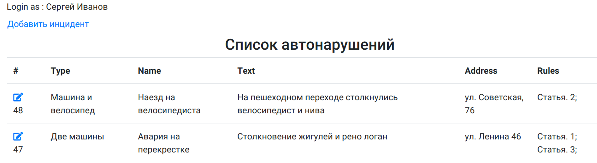
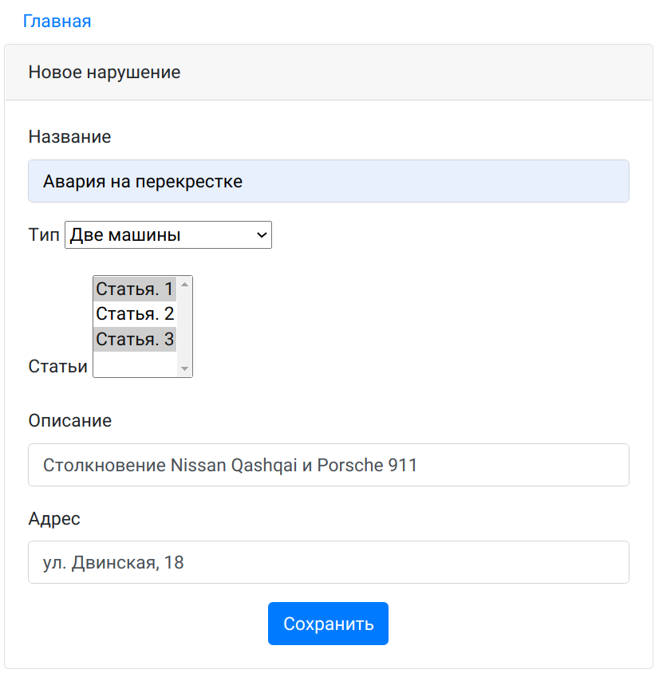
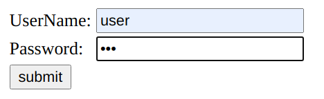
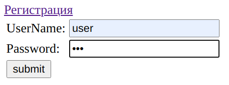
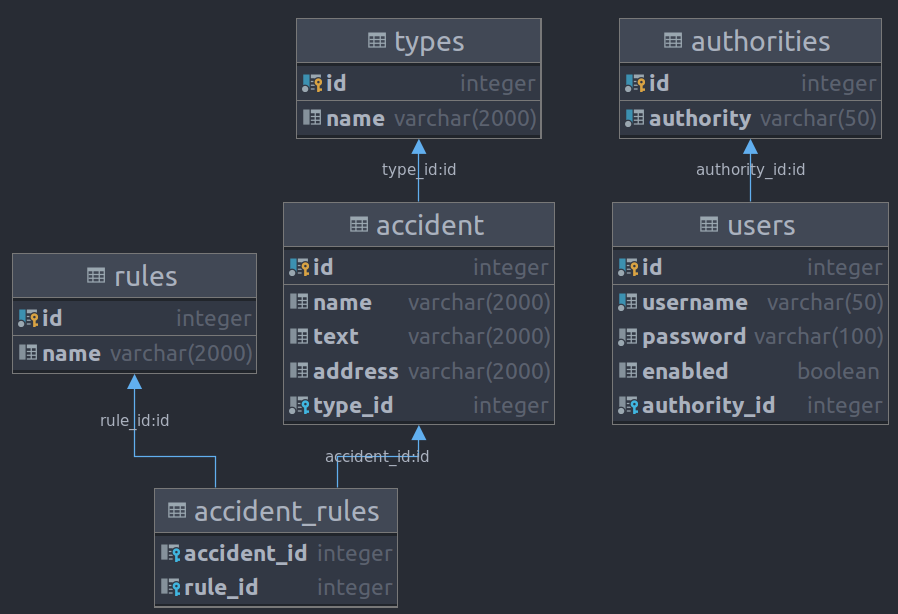

# job4j_car_accident

### Описание
Площадка для фиксации автомобильных правонарушений. 
Позволяет пользователям фиксировать ДТП. Правонарушения сохраняются в БД.

### Технологии
- Spring MVC
- Spring Security
- Spring Data
- Java 14
- Hibernate
- PostgreSQL 11
- JSP
- JSTL
- Maven
- Travis CI

### Функциональность

#### Главная страница по списком всех тем.

#### Создание новой темы.

#### Регистрация

#### Авторизация

#### Схема базы данных

